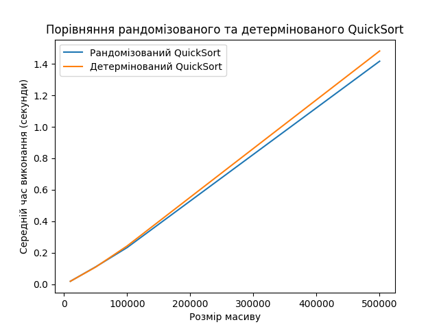

# Homework on "Algorithmic Complexity, Approximate, and Randomized Algorithms"

Hey there! 👋🏻 Ready for a new challenge?

This homework consists of two independent tasks.

In the first task, you'll implement different versions of the QuickSort algorithm, conduct empirical performance analysis, and visualize the results. By working with large datasets, you'll deepen your understanding of how pivot selection impacts sorting performance and the differences between deterministic and randomized approaches.

This hands-on experience will enhance your critical thinking skills and ability to conduct experimental research in the field of algorithms.

In the second task, you'll implement a greedy algorithm to solve a real-world optimization problem—scheduling university classes. This task will help you understand how to use the greedy approach to minimize resource usage (in this case, the number of teachers) while still achieving the goal of covering all subjects.

You'll also learn how to work with selection criteria by implementing priority-based logic, preparing you to apply such methods in real projects.

This experience will give you a solid grasp of greedy algorithms and their practical applications in optimization problems.

Let’s go! 🚵🏻‍♀️

***

## Task 1: Comparing Randomized and Deterministic QuickSort

### Task Description

1. Implement both randomized and deterministic QuickSort algorithms. Conduct a comparative analysis of their efficiency by measuring the average execution time on arrays of different sizes.

### Technical Requirements

1. Implement the randomized QuickSort algorithm in a function `randomized_quick_sort(arr)`, where the pivot element is chosen randomly.
2. Implement the deterministic QuickSort algorithm in a function `deterministic_quick_sort(arr)`, where the pivot is selected using a fixed rule (first, last, or middle element).
3. Generate test arrays of varying sizes: 10,000, 50,000, 100,000, and 500,000 elements, filled with random integers.
4. Measure the execution time of both algorithms on each array. To ensure accuracy, repeat sorting five times per array and calculate the average time.

Acceptance Criteria
📌 These criteria must be met for the mentor to review your homework. If any criteria are missing, your submission will be returned for revision without evaluation. If you need clarification 😉 or get stuck at any stage, reach out to your mentor on Slack.

1. The functions `randomized_quick_sort` and `deterministic_quick_sort` correctly implement sorting algorithms and produce sorted arrays. (20 points)
2. Execution time is measured and presented in both table and graph formats. (10 points)
3. Graphs are properly labeled with axis titles and a legend. (5 points)
4. An analysis of results is provided, with conclusions on the efficiency of randomized vs. deterministic QuickSort. (10 points)
5. The code includes a usage example and produces expected results. (5 points)

Example Output
Graph example (to be generated by your program)



Terminal output example

```python
Array size: 10000
   Randomized QuickSort: 0.0189 seconds
   Deterministic QuickSort: 0.0189 seconds

Array size: 50000
   Randomized QuickSort: 0.1104 seconds
   Deterministic QuickSort: 0.1090 seconds

Array size: 100000
   Randomized QuickSort: 0.2333 seconds
   Deterministic QuickSort: 0.2435 seconds

Array size: 500000
   Randomized QuickSort: 1.4166 seconds
   Deterministic QuickSort: 1.4815 seconds
```

***

## Task 2: Class Scheduling with a Greedy Algorithm

### Task Description

Implement a program to generate a university class schedule using a greedy algorithm to solve the set cover problem. The goal is to assign teachers to subjects in a way that minimizes the number of teachers while ensuring all subjects are covered.

### Technical Requirements

Given a set of subjects:

```python
subjects = {'Mathematics', 'Physics', 'Chemistry', 'Computer Science', 'Biology'}
```

And a list of teachers:

1. Oleksandr Ivanenko, 45 years old, `o.ivanenko@example.com`, subjects: `{Mathematics, Physics}`
2. Maria Petrenko, 38 years old, `m.petrenko@example.com`, subjects: `{Chemistry}`
3. Serhii Kovalenko, 50 years old, `s.kovalenko@example.com`, subjects: `{Computer Science, Mathematics}`
4. Nataliia Shevchenko, 29 years old, `n.shevchenko@example.com`, subjects: `{Biology, Chemistry}`
5. Dmytro Bondarenko, 35 years old, `d.bondarenko@example.com`, subjects: `{Physics, Computer Science}`
6. Olena Hrytsenko, 42 years old, `o.grytsenko@example.com`, subjects: `{Biology}`

### Implementation Details

Define a `Teacher` class with the following attributes:
- `first_name`
- `last_name`
- `age`
- `email`
- `can_teach_subjects` (set of subjects the teacher can teach)
- Implement the function `create_schedule(subjects, teachers)`, which applies a greedy algorithm to assign teachers to subjects.
- The function should return a list of teachers and the subjects assigned to them.
- At each step, prioritize the teacher who can cover the largest number of remaining subjects. If multiple candidates qualify, choose the youngest teacher.


### Acceptance Criteria

1. The program successfully assigns teachers to cover all subjects. (20 points)
2. If not all subjects can be covered, the program outputs an appropriate message. (15 points)
3. All subjects are assigned to teachers, and no teacher is given subjects they are not qualified to teach. (15 points)

### Template Code


```python
# Define the Teacher class
class Teacher:
    pass

def create_schedule(subjects, teachers):
    pass

if __name__ == '__main__':
    # Set of subjects
    subjects = {}

    # List of teachers
    teachers = []

    # Generate the schedule
    schedule = create_schedule(subjects, teachers)

    # Print the schedule
    if schedule:
        print("Class Schedule:")
        for teacher in schedule:
            print(f"{teacher.first_name} {teacher.last_name}, {teacher.age} years old, email: {teacher.email}")
            print(f"   Teaches: {', '.join(teacher.assigned_subjects)}\n")
    else:
        print("It is impossible to cover all subjects with the available teachers.")
```

This assignment will give you practical experience with sorting algorithms and optimization strategies, helping you develop both theoretical understanding and hands-on coding skills.

Good luck! 🚀